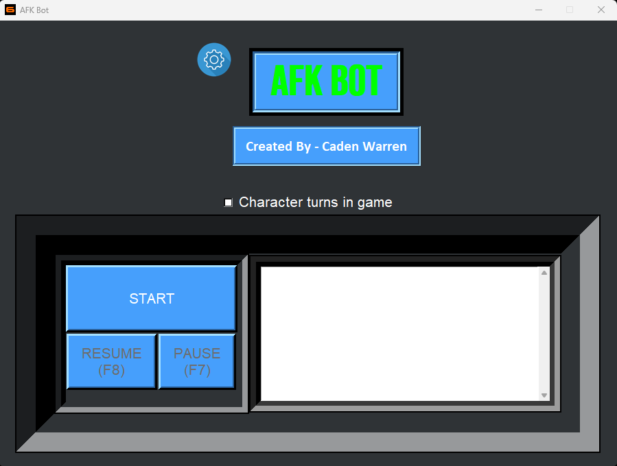
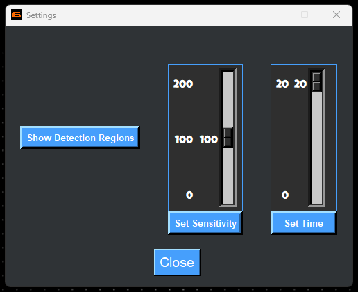

# AFK Black Ops 6 Bot

## Video - Showcase + Tutorial
> [!TIP]
> https://youtu.be/s1o2fyUEcIo

# NEW: AFK Bot V3 - GUI Update

## Overview

Advanced automation bot for Black Ops 6. Simulates human-like behavior by performing mouse movements, keyboard actions, and screen detections, allowing you to stay active in the game.

The script is fully configurable and utilizes Python libraries like `pynput, pyfiglet, cv2 (OpenCV), and pyautogui` to handle inputs, screen detection, and automation.

**Use in modes that won't negatively affect other players: FFA, 10v10, Stakeout 24/7**
---

## Features

1. **Mouse Control**
   - Perform relative mouse movements like 180°, 360°, or random turns.
   - Simulate smooth and dynamic cursor movements for more accurate human-like behavior.

2. **Keyboard Actions**
   - Execute common in-game commands such as Sprint, Slide, Crouch, Jump, and Inspect.
   - Randomize actions for unpredictable, human-like behavior.

3. **Screen Detection**
   - Detect in-game UI elements such as mini map, kill feed, or match in progress icon using OpenCV template matching.
   - Automate responses to specific screen events like skipping kill cams or selecting loadouts.

4. **Recovery Mechanism**
   - Automatically rejoin matches if kicked or disconnected, with predefined mouse-click actions.

5. **Dynamic Status**
   - Automatic Pause in menu and Resume in game
   - Monitors in-game activity and adjusts behavior accordingly.
   

---

## Prerequisites

1. **Python Libraries**
   in your preferred terminal: cd "'path/of/folder/'" # root path where all files are. Should see the requirements.txt here.
   Install the required libraries:
   pip install -r requirements.txt

2. **Fonts**
   - Place the fonts from the fonts folder in your Control Panel/Fonts
  
2. **Game Settings**
   - Set game to Fullscreen Exclusive
   - Set game display to 1920x1080
   - Set game Interaface custom hud to 'Mission Interface' for best results

3. **Screen Resolution**
Ensure your screen resolution matches the coordinates used in the script. Modify the regions if needed.

## How to Use
- Clone or download this repository.
- Follow Prerequisites
- Run the script: afk.py or GUI.py
- Follow on-screen instructions to enable or disable mouse movements.

## Custom App Icon
- Right-Click afk.py
- Create shortcut
- Right-Click afk.py shortcut
- click properties
- click change icon
- click Browse
- Select an icon from the 'Icons' folder
- Feel free to move it to your desktop and change the name from 'afk.py - shortcut'
  
## Important Notes
- Customization: Adjust sensitivity and the time it will wait pause commands after not seeing an in game image
- Safety: Use responsibly and comply with the terms of the game.
- Supported Platforms: Windows (Black Ops 6 is not supported on Linux)

## Acknowledgments
Creator: Caden Warren
